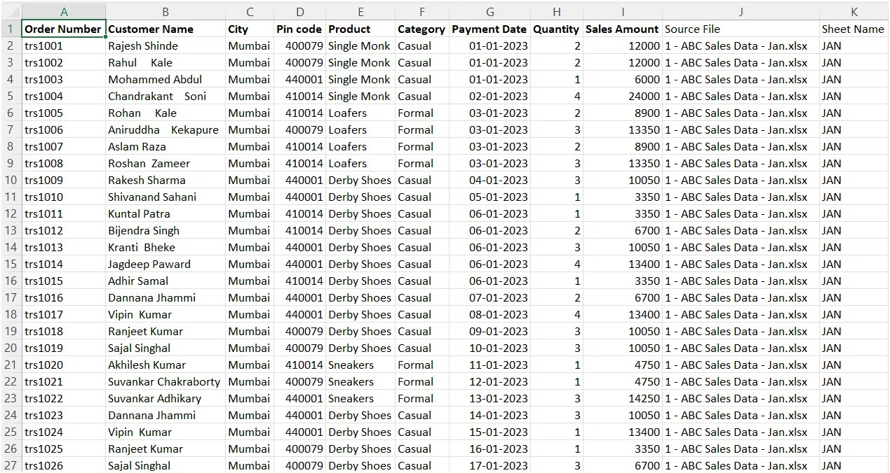
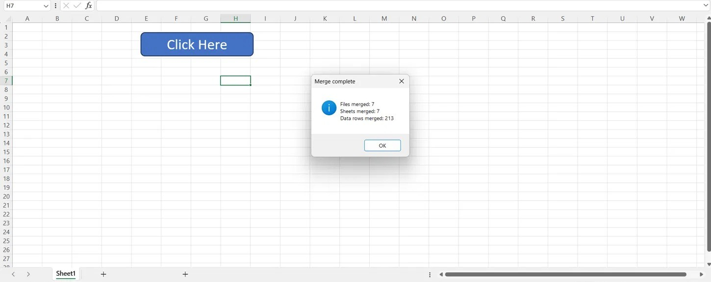

## Excel VBA: Merge Multiple Files and Sheets into One Master Sheet

An Excel VBA macro that consolidates every worksheet of every Excel file in a folder into a single master sheet.
The header is copied once, and every row is tagged with the file and sheet it came from.

## Result on the sample data
7 monthly sales files (Jan-Jul), one sheet each, merged with a single click:

| Files merged | Sheets merged | Data rows merged | Columns |
|---|---|---|---|
| 7 | 7 | 213 | 11 (9 original + Source File + Sheet Name) |

## What it does
- Opens a folder picker and reads every `.xls*` file in the selected folder
- Loops through all visible worksheets in each file
- Writes all data into a new sheet `Combined_Data_<time>`, with the header only once
- Adds `Source File` and `Sheet Name` columns so every row is traceable to its origin
- Skips temporary lock files (`~$...`) and the macro workbook itself
- Merges a sheet only if its column count matches the first sheet, and reports the skipped ones
- Detects the last row and column across the whole sheet, so rows with a blank first column are not lost
- Shows a summary of files, sheets and rows merged, which can be checked against the source files
- Includes error handling, so files are closed and screen updating is restored if something fails

## Repository contents
| File | Description |
|---|---|
| `Merge_Multiple_Files_and_Sheets.xlsm` | Workbook with the macro and a "Click Here" button |
| `MergeFiles.bas` | The VBA module, exported for easy viewing or import |
| `sample_data/` | 7 monthly sample files used for the demo |
| `output_preview.png`, `summary.png` | Screenshots of the result |

## How to use
1. Download the repository and open `Merge_Multiple_Files_and_Sheets.xlsm`
2. Click **Enable Content** when Excel asks to enable macros
3. Click the **Click Here** button on Sheet1
4. Select the `sample_data` folder (or any folder with your own Excel files)
5. A new sheet with the merged data is created, and a summary box appears

If macros are blocked on a downloaded file: right-click the file, choose **Properties**, tick **Unblock**, then reopen it.

To use the macro in another workbook: in the VBA editor (Alt + F11), choose **File > Import File** and import `MergeFiles.bas`.

## How it works
1. `FileDialog` lets the user pick the folder
2. `Dir` loops through every Excel file in the folder
3. Each file is opened read-only, and each visible sheet is checked for its last used row and column
4. The header is copied once; data rows are copied below the previous block
5. Source file and sheet name are written next to every merged row
6. Files are closed, counters are updated, and a summary is displayed

## Limitations
- The header is expected in row 1 and data from row 2
- All sheets must have the same column layout as the first sheet; others are skipped and listed in the summary
- Hidden sheets are not merged

## Skills demonstrated
Excel VBA, process automation, file and folder handling, looping through workbooks and worksheets,
dynamic range detection, data validation through row counts, error handling, MIS reporting

## Typical use cases
Merging monthly or weekly MIS reports, consolidating branch-wise or region-wise files,
removing repetitive copy-paste work from recurring reporting

## Credits and sample data
The approach was learned from Satish Dhawale's YouTube tutorial on merging files in Excel, and the 7 sample
files (ABC Sales Data, Jan-Jul) come from that tutorial. They are used here only for practice and demonstration.
Tutorial: <paste the video link here>

I extended the original approach with source-file and sheet tracking, lock-file and self-file skipping,
column-count validation, last-row detection across all columns, error handling and a merge summary.

## Author
Nidhi Gupta | [LinkedIn](https://www.linkedin.com/in/nidhigupta1997) | [GitHub](https://github.com/nidhigupta868714-ai)
